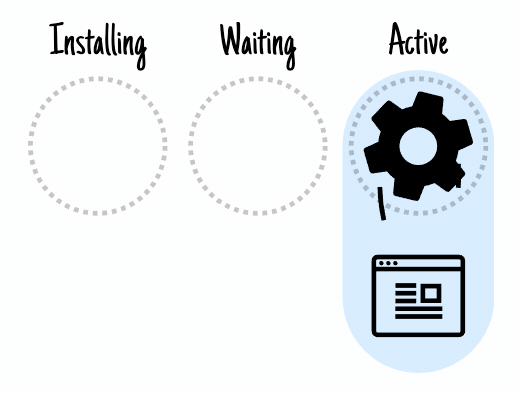
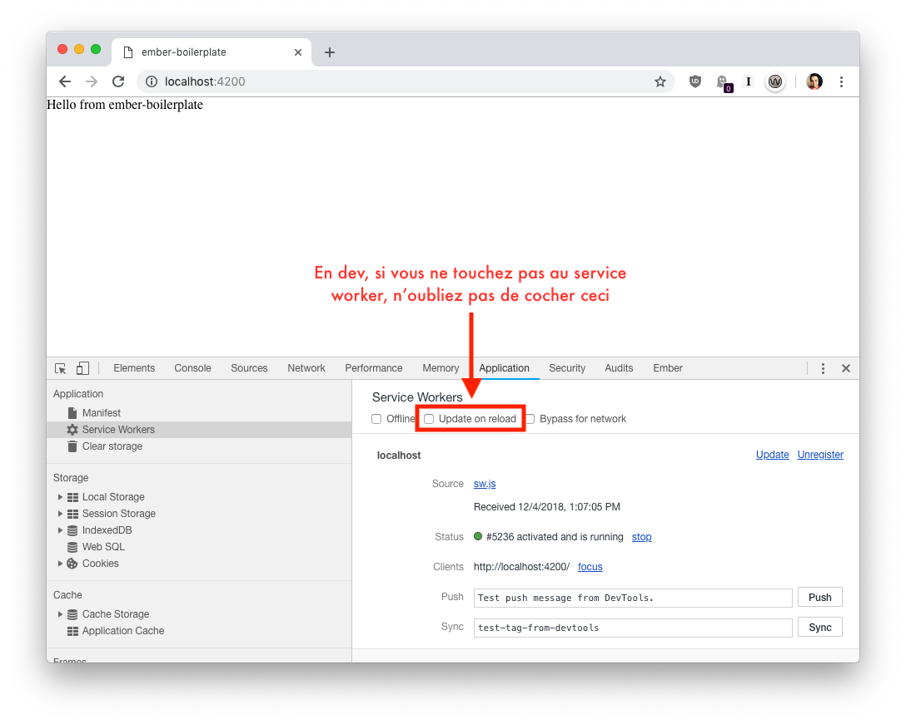

# Service Worker

Ce document n’est en aucun cas une référence complète, il vise plutôt à expliquer les concepts de base entourant les service workers ainsi que l’utilisation que l’on en fait dans le boilerplate.

## 🎯 Objectifs

### Pourquoi utilise-t-on un service worker dans nos applications?

TLDR; On utilise le service worker pour mettre en cache les assets de l’application et les charger instantannément lorsque l’utilisateur revient sur notre site.

Un service worker permet de faire plusieurs choses: souscrire à un channel de push notifications, recevoir des événements de background sync, etc. Mais la raison principale de notre utilisation est l'interception de requêtes HTTP que le worker nous permet de faire.

Lorsque notre app est chargée par le browser, on installe un service worker. Celui-ci, pendant sa phase d’installation, télécharge les assets de notre application en background. Une fois téléchargés, ces assets seront mis en cache pour utilisation future. Dès que l’utilisateur reviendra sur notre application, on lui servira les assets qui viennent de la cache. On profite donc d’un gain de performance important puisque le browser ne fait plus de requêtes réseaux pour charger notre application! Si on y met un peu d’effort, il est possible de faire fonctionner l’application complètement hors-ligne.

## ⚙️ Fonctionnement

### Comment fonctionne l’installation du service worker dans le boilerplate

#### Lors de la première visite

Le browser va d’abord télécharger le service worker puis commencer le processus d’installation. Notre setup va suivre les étapes suivantes:

1. Télécharger le fichier `asset-cache-manifest.json`
2. Télécharger tous les assets listés dans le cache manifest. Le fichier inclut:

   - Les fichiers JavaScript
   - Les fichiers CSS
   - Les fichiers d’images
   - Les fichiers de fonts
   - Le fichier `index.html` qui est aliasé sous `/assets/index-{app version}.html` pour éviter des problèmes de cache
   - Les source maps pour le JavaScript et le CSS

3. Mettre en cache les fichiers téléchargés
4. Activer le service worker pour intercepter les requêtes subséquentes


**À noter:**

- Si une des étapes échoue, l’installation au complet est annulée et le service worker ne sera pas activé.
- Si on dépend d’asset distant tel que Google Fonts ou autre, on peut les ajouter dans la liste d’asset à mettre en cache dans le fichier `service-worker/index.js`
- Le fichier `index.html` doit être mis en cache puisque lorsque l’application sera servie par le worker, FastBoot sera complètement ignoré et donc on doit fournir un « shell » à notre application pour s’exécuter.

#### Lors des visites subséquentes

Le browser va re-télécharger le service worker, si le fichier est identique « byte for byte », le service worker actuel continue d’être actif, rien ne se passe.

Par contre, si le fichier a changé, le browser va commencer le processus d’installation du nouveau worker tout en laissant l’ancien worker intercepter les requêtes. Le processus d’installation est le même qu’à la première visite, excepté que le service worker ne sera pas activé tout de suite; il va être en « waiting state ».

Un worker en « waiting state » peut être activé par 2 événements:

- l’utilisateur navigue; via un refresh ou vers une autre page
- notre application force une navigation; via un refresh ou vers une autre page

Note: "une autre page" veut dire une page qui n’est pas dans notre app Ember, celle-ci ne recharge pas le HTML comme une navigation standard le ferait



**Le setup de base du boilerplate force un refresh dès que l’installation d’un nouveau worker est terminée. Par contre, sachez que tous les outils sont à votre disposition pour afficher un message qui demande à l’utilsateur d’installer la mise à jour.**

Lorsque le nouveau worker est activé, l’ancien devient « redundant » c’est à dire qu’il sera supprimé par le browser à un moment donné mais il ne reçoit plus aucune requête. Sa cache va aussi être supprimée pour ne pas excéder le quota d’espace disque auquel on a droit.

## Outils à votre disposition

### Chrome DevTools

Les service workers sont facilement accessibles à travers les DevTools de Chrome. À ce jour, c’est l’outil le plus développé pour déboguer un worker. Vous pourrez y voir votre worker ainsi que sa cache dans la section « Application ».

Comme en développement on veut souvent passer par-dessus le service worker pour toujours avoir la version à jour de notre code, on peut demander à Chrome de force la mise à jour à tous les refresh:



### Ember service `service-worker.js`

Pour faciliter l’interaction avec le service worker, le boilerplate contient aussi un service nommé `service-worker` qui permet de faire les opérations de base.

## 📬 Mise à jour

### J’ai déployé une nouvelle version, comment notifier mes utilisateurs?

Comme ce scénario est un peu « cas par cas » il n’est pas implémenté par défaut dans le boilerplate. Par contre, il serait assez simple à faire avec notre service.

```
import {task, timeout} from 'ember-concurrency';

// ...

serviceWorkerUpdateCheckTask: task(function *() {
  while (true) {
    this.serviceWorker.checkForUpdates();

    yield timeout(ONE_HOUR_IN_MILLISECONDS);
  }
})

// ...

this.serviceWorker.onUpdateReady(() => {
  const response = this.confirmDialog.show({
    message: 'Update available',
    confirmLabel: 'Update now',
    cancelLabel: 'Cancel'
  });

  if (response) this.serviceWorker.update();
});
```

**Note:** Le code suivant demande au browser de faire un update périodique du service worker, sachez que ces updates sont limités par le browser, **ne demandez jamais des updates à toutes les minutes** par exemple.

Sachez aussi que `checkForUpdates` va passer par le processus d’update normal, vous serez donc notifié à travers le callback `onUpdateReady` comme lors d’un refresh de page.
